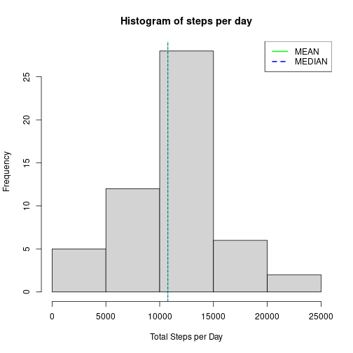
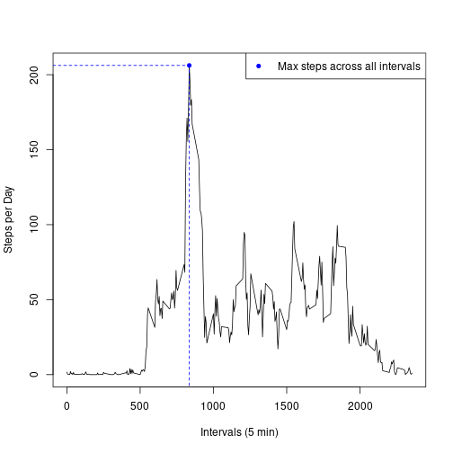
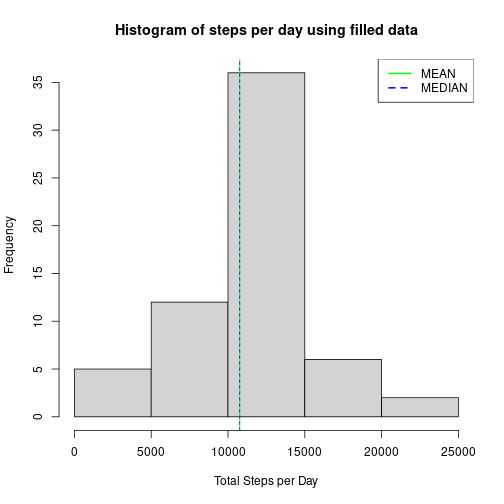
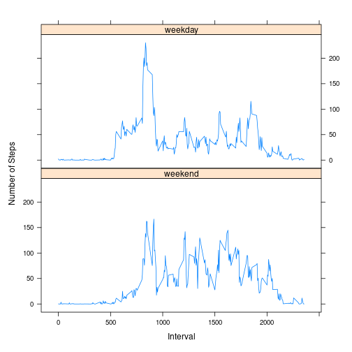

## Loading and preprocessing the data


```r
library(dplyr)

if(!file.exists("activity.csv")) {
    unzip("activity.csv")
}

data <- read.csv("./activity.csv")
data <- transform(data, date = as.Date(date, "%Y-%m-%d"))
```

## What is mean total number of steps taken per day?


```r
data_by_date <- data %>% 
    group_by(date) %>% 
    summarise(
        total = sum(steps)
    )

mean_steps_per_day <- mean(data_by_date$total, na.rm = TRUE)
median_steps_per_day <- median(data_by_date$total, na.rm = TRUE)

hist(
    data_by_date$total, 
    main = "Histogram of steps per day", 
    xlab = "Total Steps per Day"
)
abline(v = mean_steps_per_day, col = "green", lwd = 1)
abline(v = median_steps_per_day, col = "blue", lwd = 1, lty = 2)
legend(
    x = "topright", 
    legend = c("MEAN", "MEDIAN"), 
    lty = c(1, 2), 
    col = c("green", "blue"),
    lwd = 2
)
```



```r
mean_steps_per_day
```

```
## [1] 10766.19
```

```r
median_steps_per_day
```

```
## [1] 10765
```

## What is the average daily activity pattern?


```r
interval_avg <- data %>% 
    group_by(interval) %>% 
    summarise(step_avg = mean(steps, na.rm = TRUE))

max_steps_in_interval <- max(interval_avg$step_avg)
interval_with_max_steps <- interval_avg$interval[
    interval_avg$step_avg == max_steps_in_interval
]

plot(
    interval_avg$interval, 
    interval_avg$step_avg,
    type = "l",
    xlab = "Intervals (5 min)",
    ylab = "Steps per Day"
)
points(
    interval_with_max_steps, 
    max_steps_in_interval, 
    pch = 20, 
    lwd = 2,
    col = "blue"
)
segments(
    x0 = -500, #to get the line to meet the axis
    y0 = max_steps_in_interval,
    x1 = interval_with_max_steps,
    y1 = max_steps_in_interval,
    lty = 2,
    col = "blue"
)
segments(
    x0 = interval_with_max_steps, #to get the line to meet the axis
    y0 = -500,
    x1 = interval_with_max_steps,
    y1 = max_steps_in_interval,
    lty = 2,
    col = "blue"
)
legend(
    x = "topright", 
    legend = c("Max steps across all intervals"), 
    pch = c(20), 
    col = c("blue"),
    lty = c(0),
    lwd = c(2)
)
```



```r
interval_with_max_steps
```

```
## [1] 835
```

```r
max_steps_in_interval
```

```
## [1] 206.1698
```

## Imputing missing values
The missing values are imputed using the average of the specified interval across all dates

```r
missing_values <- which(is.na(data$steps))
filled_data <- data.frame(data)  # copy the data to new object

for (val in missing_values) {
    filled_data$steps[val] <- interval_avg$step_avg[
        interval_avg$interval == data$interval[val]
    ]
}

filled_data_by_date <- filled_data %>% 
    group_by(date) %>% 
    summarise(
        total = sum(steps)
    )

filled_mean_steps_per_day <- mean(filled_data_by_date$total)
filled_median_steps_per_day <- median(filled_data_by_date$total)

hist(
    filled_data_by_date$total, 
    main = "Histogram of steps per day using filled data", 
    xlab = "Total Steps per Day"
)
abline(v = filled_mean_steps_per_day, col = "green", lwd = 1)
abline(v = filled_median_steps_per_day, col = "blue", lwd = 1, lty = 2)
legend(
    x = "topright", 
    legend = c("MEAN", "MEDIAN"), 
    lty = c(1, 2), 
    col = c("green", "blue"),
    lwd = 2
)
```



### What is the difference between the filled data, and the orginal data?


```r
filled_mean_steps_per_day
```

```
## [1] 10766.19
```

```r
mean_steps_per_day
```

```
## [1] 10766.19
```

```r
filled_median_steps_per_day
```

```
## [1] 10766.19
```

```r
median_steps_per_day
```

```
## [1] 10765
```

## Are there differences in activity patterns between weekdays and weekends?

```r
library(lattice)

weekdays <- c("Monday", "Tuesday", "Wednesday", "Thursday", "Friday")
filled_data$weekday <- factor(
    weekdays(filled_data$date) %in% weekdays,
    levels = c(FALSE, TRUE),
    labels = c("weekend", "weekday")
)
filled_interval_avg <- filled_data %>% 
    group_by(weekday, interval) %>% 
    summarise(mean_steps = mean(steps))
```

```
## `summarise()` has grouped output by 'weekday'. You can override using the `.groups` argument.
```

```r
xyplot(
    mean_steps ~ interval | weekday, 
    data = filled_interval_avg, 
    type = "l",
    layout = c(1, 2),
    ylab = "Number of Steps",
    xlab = "Interval"
)
```


